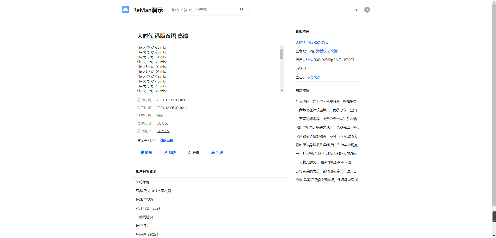

# ReMan 网盘搜索引擎源码


> 支持 百度网盘、阿里云盘、夸克网盘、迅雷网盘的搜索引擎


## 特点

特点：

- 拥有后台，灵活配置
- 支持手机端和电脑端（前台）
- 程序本身只有两个文件：config.yml 和 reman（二进制文件）

特色功能：

- 支持设置分类，可以按分类展示资源列表
- 支持设置资源是自己的，这将在搜索结果中排在前面（有助于网盘拉新）
- 提供热词、热门资源记录，可以在后台查看搜索热词
- 等等其它功能，在下面的演示环境中体验吧！


详细文档参见：https://docs.hunhepan.com/reman/


## 演示环境

首页：https://reman.xwd.pw

后台登录：https://reman.xwd.pw/login

用户名：admin

密码：Au2m1TdM


## 推荐的服务器

大陆服务器需要备案，这是常识，不多说；**建议的是香港服务器**

然后首推的是阿里、腾讯香港轻量服务器，价格便宜，性能也不错；（最近腾讯好像没有2c4g这种配置了，所以可以阿里云购买）

---

如果，你不想用大厂的服务器，可以雨云，这是一家小众的云服务商，价格也还能接受，主要是查IP，不会有`[中国香港香港 阿里云]`这种

**当然，稳定性肯定是不如大厂的，这点要知道**


雨云地址：[https://www.rainyun.com](https://www.rainyun.com/Mzc4MDI=_)

## 截图





## 所需服务部署

运行整套服务，最少需要服务器配置：`2c4g` 即 `2核4G`

系统 `Centos` 或 `Ubuntu` x86_64 均可

- mysql
- redis
- elasticsearch
- Caddy2

### MRE

- mysql
- redis
- elasticsearch

可以使用我为大家准备的`docker compose`文件，一键运行上述 3 个服务

https://wwhb.lanzouw.com/iB1dS1gt9trc

```sh
sudo docker compose up -d
```

> docker 如何安装，请看本文附录

### Caddy2

介绍：Caddy2 是由 golang 开发的一款类似 nginx 的 http 服务器，我们使用它来作为后端程序的反向代理工具；

使用它最重要的原因是它可以自动为我们生成 tls 证书，让我们的网站挂上绿锁（https）

下载：

https://caddyserver.com/download

配置示例：

```txt
{
    email test@example.com
}

example.com www.example.com {
    reverse_proxy http://127.0.0.1:4677
}
```

将上述内容保存为`Caddyfile`

运行示例，假设：`Caddyfile`和`caddy`在同一目录：

```sh
chmod +x caddy # 首次执行，需要添加执行权限
./caddy run # 不知道配置文件有没有问题，可以先使用`run`，没有报错，则之后可以使用`start`后台运行（如下）
./caddy start # start 就是直接后台运行
```

## 程序运行

本程序本身，只有 2 个文件：


一个程序本体，一个配置文件

### 配置文件

```yml
app:
  mode: debug # 程序运行的模式,  debug 或 release
  port: 4677 # 程序监听的端口
  license: your license code # 授权码
cors:
  allowCredentials: true
  allowOrigin: # 到时候需要在下面加上你的域名
    - http://localhost:*
    - http://127.0.0.1:*
  maxAge: 24h
db:
  database: go-re-man # 数据库名称
  dialect: mysql # 默认即可
  host: 127.0.0.1 # 数据库地址
  username: root # 数据库用户
  password: 123456 # 密码
  port: 3306 # 端口
  autoMigrate: true # 自动迁移，即自动建立数据库表，这个目前必须为true

es:
  enable: true # 目前必须为true
  address: http://127.0.0.1:9200 # elasticsearch的地址
  diskIndex: reman-disk-v1 # 索引名称，可改可不改

jwt:
  secret: secret # jwt签名密钥，必须修改
  expire: 24h # 过期时间，这里即表示，每24小时过期，即需要重新登录
  issuer: reman
log:
  format: text
  level: debug
  linkName: current.log
  path: ./logs
redis:
  addr: 127.0.0.1:6379 # redis数据库地址
  db: 0
  password: '' # 密码
```

需要配置的有：

`db`：即 mysql 数据库

`redis`：即 redis 数据库

`es`：即 elasticsaerch 全文检索数据库 7.x 版本，特别注意，es 分词器，我们使用的是`hao`：https://github.com/tenlee2012/elasticsearch-analysis-hao

还需要填写的是：`jwt.secret`，这个汲及到登录安全问题，在程序内部是强制要求修改的，15 位以上的随机字符串

### 首次运行

一般，分发的程序名称类型类似：`reman_linux_amd64_v0.0.9`

所以需要先改名：

```sh
mv reman_linux_amd64_v0.0.9 reman
```

> 上面的`reman_linux_amd64_v0.0.9`是例子，不是每次都是 0.0.9，所以请根据实际来

运行程序，首先需要确保程序有执行权限：

```sh
chmod +x ./reman
```

运行（配置文件已修改完毕）：

```sh
./reman
```

但是上面这种运行是会随着 terminal 关闭而关闭的，所以一个最简单的办法是使用 `nohup`

```sh
nohup ./reman &
```

### 程序更新

程序更新需要先停掉之前的旧程序：

```sh
kill `pgrep reman` # 这一步是找到reman程序并kill掉，一般步骤可以是：`ps aux|grep reman` 找到pid，然后 `kill pid`
```

然后，按照首次运行程序时的命令：

```sh
mv reman_linux_amd64_v0.0.9 reman
chmod +x ./reman
nohup ./reman &
```

> 这种运行和更新程序的方法其实不太好，所以建议是使用`pm2`来管理和守护我们的程序
>
> 如何使用`pm2`请参考附录

---

购买咨询可加微信：apkapb 备注：reman

